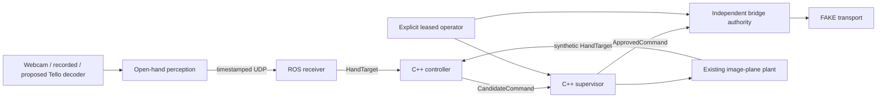

# Vision-guided Tello

Keep one eligible open hand near the image centre using lateral and vertical
translation. Laptop perception feeds the existing ROS 2 Jazzy C++ controller and
supervisor. Autonomous forward/backward and yaw stay zero. Distance remains manual.

The offline preparation now includes a passive evidence monitor, actual loopback
UDP/ROS tests, an independently guarded **fake** command bridge, operator leases,
frame sources, and an explicitly invoked non-actuating SDK/video diagnostic.
Normal launch starts disabled. Hardware ROS actuation remains gated pending real
network, lifecycle and operator-control evidence. This checkpoint is not flight readiness.



Choose the webcam chain or the mock in separate namespaces; the webcam is not a
feedback plant. New launch paths use fake transport; live camera scripts require deliberate
invocation. Importing transport/frame adapters opens no camera, socket or SDK session.

Build and test on WSL Ubuntu 24.04 / ROS 2 Jazzy:

```bash
cd ~/vision_guided_tello_ws
tools/run_offline_checks.sh
source /opt/ros/jazzy/setup.bash
source install/local_setup.bash
python3 tools/offline_demo.py --scenario static --output /tmp/tello-demo-baseline
python3 tools/offline_demo.py --scenario loss --output /tmp/tello-demo-loss
```

Each demo requires a new output directory and writes synthetic reports/logs.
It explicitly enables the software mock and fake bridge for a bounded session;
ordinary launches require a separate operator enable.

The current laptop gate is the operator lease timing failure. Follow the
[paired FAKE timing diagnostic recipe](docs/lease_timing_debug.md) before repeating
acceptance. The [staged acceptance matrix](docs/user_acceptance_tests.md) follows.
See [Windows/WSL setup](docs/windows_wsl_setup.md), [authority and interfaces](docs/architecture.md),
[offline validation](docs/offline_validation.md), [current checkpoint](docs/current_checkpoint.md)
and [dependency/model provenance](docs/provenance.md).
The earlier [image-plane model record](docs/point3_image_plane_mock.md) remains relevant.
