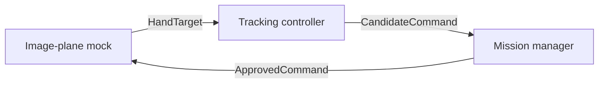

# Vision-guided Tello

ROS 2 Jazzy portfolio project: keep one usable open palm near the centre of a
standard Tello's forward-camera image using lateral and vertical translation.
The aircraft supplies low-level stabilization; laptop software supplies visual
outer-loop control and independent supervision.

Current software chain:

The mock closes the loop in software. No current package connects to or commands
an aircraft. Perception, real Tello transport and flight validation remain later
milestones. Autonomy starts disabled and requires an explicit operator service.

See [point 3 setup, model assumptions and validation](docs/point3_image_plane_mock.md).
