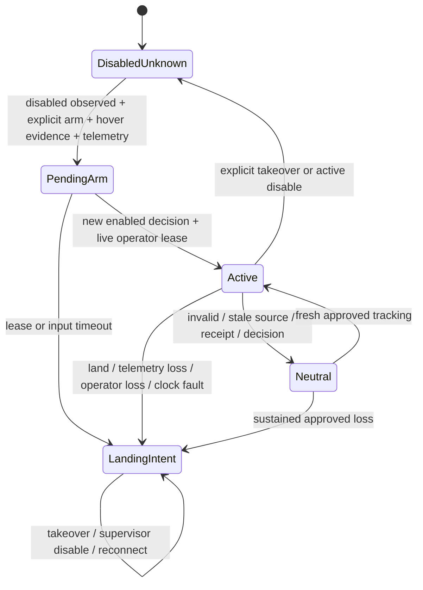

# Architecture and authority

The existing C++ policies remain the single source of tracking/supervisor policy.
The bridge independently validates their approved output at the transport boundary.

| Interface | Meaning |
|---|---|
| HandTarget.header | Software frame receipt, before inference; not exposure |
| CandidateCommand.header | Original observation; never renewed by watchdog |
| ApprovedCommand.header | Supervisor decision time |
| ApprovedCommand.source_header | Original observation, including on repeated heartbeats |
| ApprovedCommand.request_land | Intent only; not an acknowledgement or landed state |
| tello_bridge/state | Fake-labelled lifecycle/authority, latest RC and transport event |

Positive image x is right; positive image y is down. Gain 20, inclusive independent
±0.08 dead zones and ±10 clamps remain in the C++ controller. Vertical sign is
inverted. Scalars are not calibrated metres per second. Freshness is strictly
less than 250 ms for source and local receipt; the supervisor requires five
distinct observations. Its 1.5 s acquisition/loss timer starts on the first safety
update in ACQUIRE/LOST_HOVER, and is reset in TRACK. Watchdogs run every 20 ms.
Timers/executor/observer delivery add lateness; these are not physical stop guarantees.

`PendingArm` remains neutral while disabled supervisor heartbeats arrive. It exists
to avoid a race between bridge arm and the explicit supervisor enable. Once an
enabled decision is seen, any valid disabled supervisor decision revokes authority.
The bridge's explicit disable/takeover always revokes it immediately, including pending arm.
A process providing enable must renew its operator lease within 300 ms; a late
heartbeat cannot revive an expired lease. No held key or cached manual movement
interface exists. The command owner never calls blocking SDK waits.

The ROS bridge exposes private Trigger services `arm`, `heartbeat`, `disable`,
`manual_takeover`, `land`, `status`, and `prepare_fake_hover`. These supplement the
existing mission manager SetBool `set_autonomy` and Trigger `manual_takeover`;
only the latter services control the supervisor. `tello_operator` coordinates both.
It revokes bridge authority before waiting for the supervisor takeover response.
Fake hover is an explicit synthetic lifecycle reset; it is never hardware evidence.
The supervisor latch clears on takeover; the consumer landing latch does not.

Motion additionally needs fresh battery/height telemetry, explicit confirmed hover,
valid decision/source ordering, monotonic receipt, a healthy clock and the live
operator lease. Battery >=25%, height 30–150 cm, telemetry <500 ms and 20 Hz RC
are provisional development settings. They are unvalidated physical limits;
height telemetry is not an enforced geofence. Missing data prevents motion.
Telemetry height or an SDK `is_flying` cache alone does not confirm flight state.
The real ROS actuation mode deliberately fails closed until a commissioning
procedure can supply trustworthy lifecycle/operator evidence. There is no takeoff API.

The proposed nonblocking SDK adapter accepts lateral/vertical only, rounds halves
away from zero after the ±10 cap, and emits `rc lateral 0 vertical 0`. It sends the
latest command, rechecks before each send, has no reconnect backlog, and logs OS
send success separately from uncorrelated SDK replies. Neither proves physical
motion or landing. Land retries are limited to three, spaced at least one second
in the running arbiter. Manual takeover preserves landing intent. Normal shutdown
neutralizes, attempts normal land if authority was active, and closes resources;
it never calls emergency motor cut. After process death or host/Wi-Fi failure,
software cannot guarantee delivery or cleanup. In-memory latches are lost on
restart; restart is disabled with lifecycle unknown and explicit rearming required.

One local lock owns each fake namespace or hardware endpoint. This cannot arbitrate
Windows and WSL or two laptops: choose one physical command owner after routing
checks. No physical manual-control path has been demonstrated. A phone/app and
an SDK client must not be assumed to coexist; takeover service success is only
software authority revocation today.

Windows perception → WSL ROS is retained for webcam testing. Tello alternatives
are (a) capture/inference/SDK on Windows with timestamped UDP to WSL, or (b) all
capture/SDK on WSL if routing permits. Choose after actual command/state/video
routing checks. No topology or aircraft compatibility is inferred from loopback.

The official [SDK 1.3 document](https://dl-cdn.ryzerobotics.com/downloads/tello/20180910/Tello%20SDK%20Documentation%20EN_1.3.pdf)
is the command/port reference. [ROS QoS design](https://design.ros2.org/articles/qos)
explains subscription compatibility; production QoS is unchanged.
